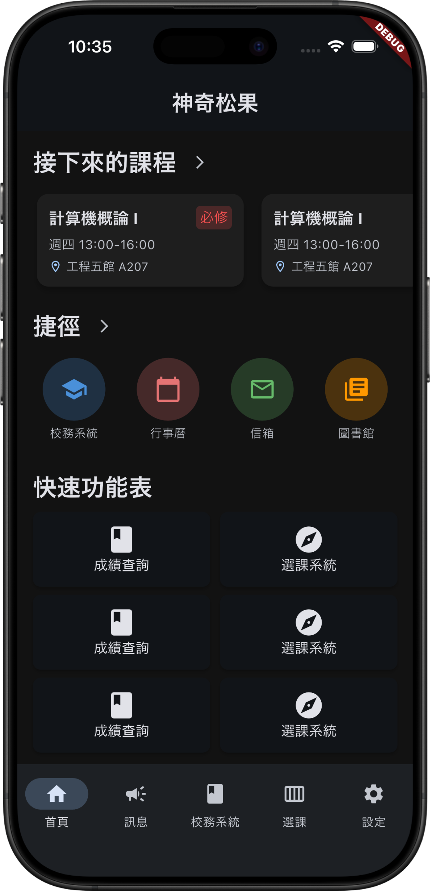
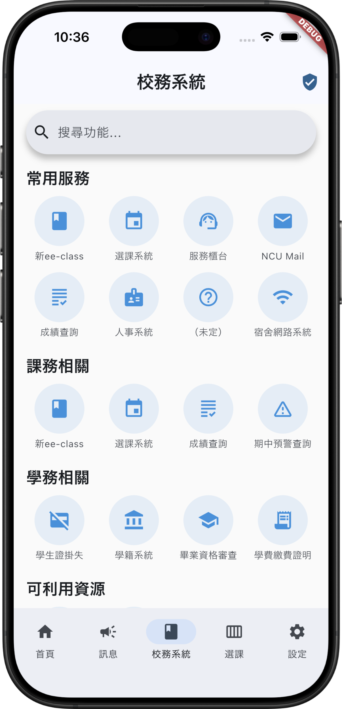

# Magic Pinecone / Open-NCU Frontend Prototype

<p align="center">
  
  
</p>

A Flutter-based frontend prototype for the NCU campus service and course selection application.

## Features

- **Portal Integration**: Includes a WebView component for accessing campus portal services directly within the app.
- **Theme Support**: Includes light and dark mode configurations.
- **Session Management**: A semi-auto portal session management to facilitate the portal workflow without storing Basic Auth credentials.

## Getting Started

### Prerequisites

- Flutter SDK (latest stable version recommended)
- Dart SDK
- The related SDK for the target platform (Xcode for iOS, Android Studio for Android)

### Installation

1. Clone the repository:
   ```bash
   git clone https://github.com/ncu-three-way-handshake/open-ncu-prototype.git
   ```
2. Install dependencies:
   ```bash
   flutter pub get
   ```
3. Run the application:
   ```bash
   flutter run
   ```

---

## Acknowledgement
**Course Finder Fetcher**: [NCU-Course-Finder-DataFetcher-v2](https://github.com/zetaraku/NCU-Course-Finder-DataFetcher-v2)

## License

This project is licensed under the MIT License - see the [LICENSE](LICENSE) file for details.

